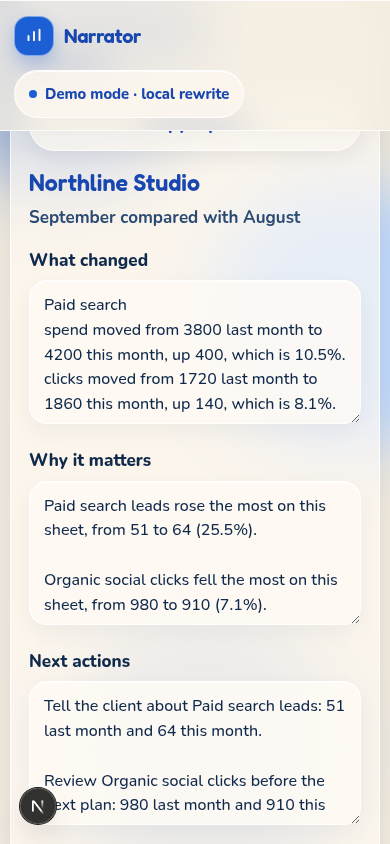

**Live preview:** https://client-report-narrator-only1nonsodev.vercel.app
# Client Report Narrator

A marketer often has a spreadsheet of one month and a client who wants a paragraph, not a grid. This is a small web page for that job.

You paste a CSV, or upload one, with a few channels or campaigns. Each row has a metric, last month, and this month. The page writes a short report in plain English:

- what changed versus the previous period
- why that change matters, using only these rows
- what to do next

It is a portfolio demo. It does not email anyone, and it is not a live agency tool.

Every number in the report comes from the sheet, or from the change between the two months on that row. The change is this month minus last month. The percent is that change divided by last month, rounded to one decimal place. If a cell is blank, the report says the figure is missing. If last month is 0, it says the percent is missing. It does not fill the gap, and it does not add an industry average, a goal, or any other statistic.

## Run it

You need [Node.js](https://nodejs.org/) 20 or newer. In a terminal:

```bash
node -v
```

If that prints `v20` or higher, install and start the app from this folder:

```bash
npm install
npm run dev
```

Open [http://localhost:3000](http://localhost:3000).

On a phone, the form is on top and the report stacks under it. This is that layout with the sample loaded:



 Buttons are at least 48px tall, and the page does not scroll sideways. On the same Wi-Fi, run `npm run dev -- --hostname 0.0.0.0` and visit `http://` plus your computer’s address plus `:3000`.

To check the report logic without the browser:

```bash
npm test
```

## Try the sample

Click **Load sample**. That one tap fills a small month for a made-up client, Northline Studio, and writes the report.

The sample has paid search, email, and organic social. Organic social impressions have a blank last month on purpose. The report says that figure is missing. It does not guess a change.

You can edit the three parts of the report, then use **Copy report**.

You can also paste your own CSV or upload a file. Use these column names:

```csv
channel,metric,last_month,this_month
Paid search,Spend,3800,4200
```

`campaign`, `kpi`, `previous`, and `current` are accepted as other names for the same columns. Leave a cell blank when you do not have the number.

## Demo mode and a real model later

**Demo mode is the default.** The page writes the report with a fixed set of rules on your computer. No account, no API key, and no request to an AI provider. The same sheet always produces the same report. The screen says **Demo mode · local rewrite**. It does not pretend ChatGPT, or any other model, wrote the text.

A real model is optional. Copy `.env.example` to `.env.local` and set:

```bash
OPENAI_API_KEY=sk-your-key-here
OPENAI_MODEL=gpt-4o-mini
```

Restart `npm run dev`. The chip changes when a key is present. If the model replies with a number that is not in the sheet, or it skips a missing figure, the page throws that reply away and shows the local report instead. The screen tells you when that happens.

`.env.local` is listed in `.gitignore`. Do not commit a key.

## Sample sheet

These rows are the built-in sample. They are not a real client’s results.

```csv
channel,metric,last_month,this_month
Paid search,Spend,3800,4200
Paid search,Clicks,1720,1860
Paid search,Leads,51,64
Email,Sends,11800,12400
Email,Opens,2950,3100
Email,Leads,79,88
Organic social,Clicks,980,910
Organic social,Leads,19,22
Organic social,Impressions,,45200
```

## Project layout

- `app/page.tsx` is the screen.
- `app/api/report/route.ts` writes the report. Demo mode does not call a model.
- `lib/narrate.ts` is the local rewrite.
- `lib/sample.ts` is the built-in sheet.
- `lib/narrate.test.ts` checks that the report does not invent numbers.
